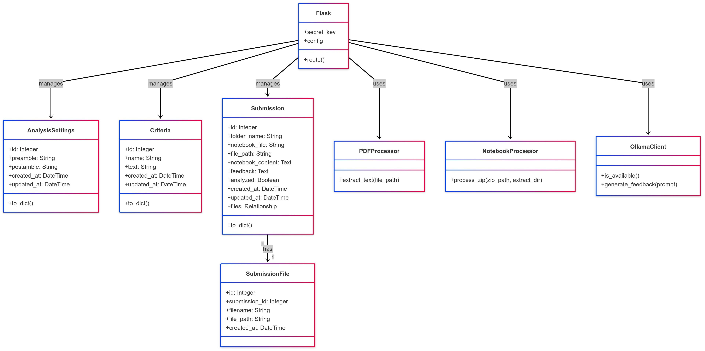
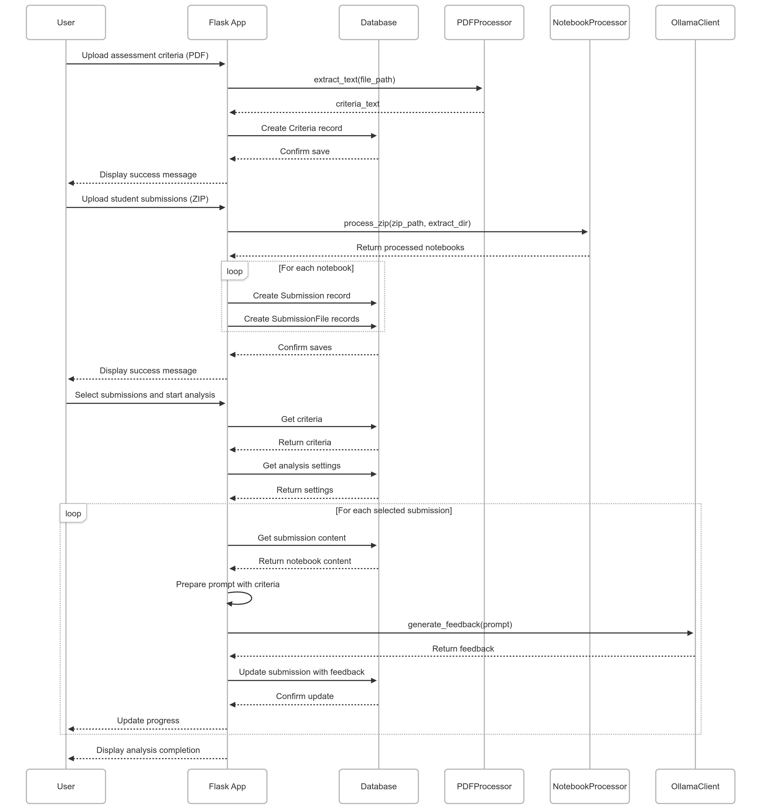

# Assessment Evaluation System

An open-source assessment evaluation system using Ollama that analyzes submitted Jupyter notebooks against criteria and generates feedback.




## Features

- Upload assessment criteria PDF files
- Upload student submissions as ZIP archives containing Jupyter notebooks
- Analyze notebooks against criteria using Ollama LLM
- Review and manually edit generated feedback
- Simple and intuitive web interface
=======
A Flask-based web application for automated assessment and feedback of Jupyter notebook submissions using AI (Ollama) and PostgreSQL.

## Features

- Upload assessment criteria as PDF
- Upload student submissions as ZIP files containing Jupyter notebooks
- Automated analysis and feedback generation using Ollama API
- View, update, and delete submissions and feedback
- Manage analysis settings (preamble, postamble)
- Progress tracking for batch analysis
- Modular codebase for easy extension

## Project Structure

```
.
├── app.py                # Main Flask application
├── models.py             # SQLAlchemy models
├── services/             # PDF, notebook, and Ollama service modules
├── templates/            # Jinja2 HTML templates
├── static/               # Static files (CSS, JS)
├── schema.sql            # PostgreSQL schema
├── .env                  # Environment variables
└── README.md             # Project documentation
```
>>>>>>> 4266b6bfedaf341c52bd2ce12b51b53912a48f2c

## Setup

### Prerequisites

<<<<<<< HEAD
- Python 3.6+
- [Ollama](https://github.com/ollama/ollama) - running either locally or remotely

### Installation

1. Clone this repository:
   ```
   git clone https://github.com/yourusername/assessment-evaluation-system.git
   cd assessment-evaluation-system
   ```

2. Install dependencies:
   ```
   pip install -r requirements.txt
   ```

3. Create an `.env` file based on the example:
   ```
   cp .env.example .env
   ```

4. Edit the `.env` file to configure your environment:
   ```
   # Ollama Configuration
   OLLAMA_API_URL=http://your-ollama-url:11434
   OLLAMA_MODEL=llama2
   
   # Flask Secret Key (for sessions)
   SESSION_SECRET=your-secret-key
   ```

5. Run the application:
   ```
   python main.py
   ```

## Connecting to Your Local Ollama Instance

By default, the application tries to connect to Ollama at `http://localhost:11434`. If you're running this application on a remote server (like Replit) but want to use your local Ollama instance:

1. Run Ollama on your local machine
2. Create a secure tunnel to your local Ollama using a service like [ngrok](https://ngrok.com/):
   ```
   ngrok http 11434
   ```
3. Copy the HTTPS forwarding URL from ngrok (e.g., `https://abcd1234.ngrok.io`)
4. Set the `OLLAMA_API_URL` environment variable in your application to this URL

## License

This project is open source and available under the [MIT License](LICENSE).
=======
- Python 3.8+
- PostgreSQL
- Ollama (running locally or remotely)
- (Optional) Docker

### 1. Clone the repository

```sh
git clone <repo-url>
cd replit
```

### 2. Install dependencies

```sh
pip install -r requirements.txt
```

### 3. Configure environment variables

Edit `.env`:

```
DATABASE_URL=postgresql://<user>:<password>@<host>:<port>/<dbname>
SESSION_SECRET=your-secret-key
OLLAMA_API_URL=http://localhost:11434
OLLAMA_MODEL=gemma3
```

### 4. Set up the database

- Ensure PostgreSQL is running and accessible.
- Create the database if it does not exist.
- Run the schema:

```sh
psql -U <user> -h <host> -d <dbname> -f schema.sql
```

### 5. Run the application

```sh
python app.py
```

Visit [http://localhost:5000](http://localhost:5000) in your browser.

## Usage

- **Upload Criteria:** Upload a PDF file describing the assessment criteria.
- **Upload Submissions:** Upload a ZIP file containing student Jupyter notebooks.
- **Analyze:** Select submissions and analyze them using the AI model.
- **View Feedback:** View and edit feedback for each submission.
- **Settings:** Update analysis preamble and postamble.

## Development

- Modularize routes and services for maintainability.
- Use SQLAlchemy for ORM and migrations.
- Extend services in `services/` for custom processing.

## Troubleshooting

- **Database connection errors:** Check your `.env` and PostgreSQL status.
- **Ollama API errors:** Ensure Ollama is running and accessible at the configured URL.
- **File upload issues:** Ensure the `uploads/` directory is writable.

## License

MIT License

---

*Generated by GitHub Copilot*
>>>>>>> 4266b6bfedaf341c52bd2ce12b51b53912a48f2c
